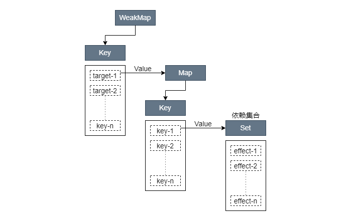
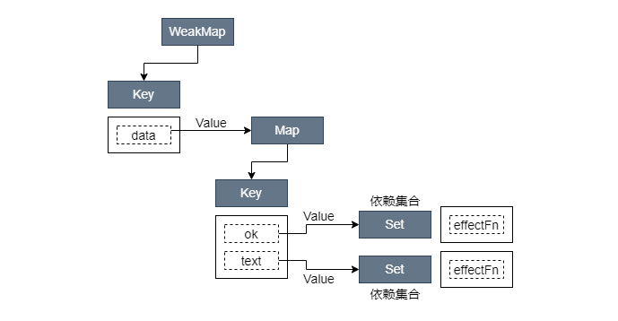
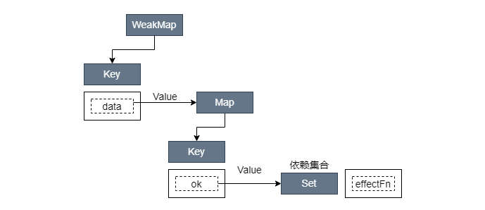
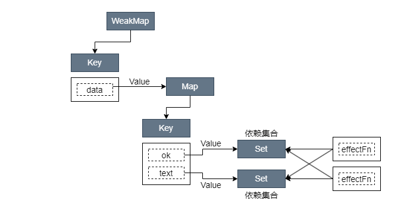

# 响应系统

## 4. 响应系统的作用与实现

### 4.1 响应式数据与副作用函数

副作用函数指的是会产生副作用的函数：

``` javascript
function effect() {
	document.body.innerText = 'hellow vue3';
}
```

当 `effect` 函数执行时，它会设置 `body` 的文本内容，但除了 `effect` 函数之外的任何函数都可以读取或设置 `body` 的文本内容。也就是说 `effect` 函数的执行会直接或间接影响其它函数的执行，这是我们说 `effect` 函数产生了副作用。副作用很容易产生，例如一个函数修改了全局变量，这也是一个副作用：

``` javascript
// 全局变量
let val = 1;
 
function effect() {
  val = 2; // 修改全局变量，产生副作用
}
```

理解了声明式副作用函数，再来说看看什么是响应式数据，假设在一个副作用函数中读取了某个对象的属性：

``` javascript
const obj = {
  text: 'hello world'
};
 
function effect() {
  document.body.innerText = obj.text;
}
```

上面的代码中，副作用函数 `effect` 会设置 `body` 元素的 `innerText` 属性，其值为 `obj.text`，当 `obj.text` 的值发生变化时，我们希望副作用函数 `effect` 会重新执行：

``` javascript
obj.text = 'hello vue3'; // 修改 obj.text 的值，同时希望副作用函数会重新执行
```

这里修改了字段 `obj.text` 的值，我们希望当值发生变化后，副作用函数自动重新执行，如果能实现这个目标，那么对象 `obj` 就是响应式数据。

### 4.2 响应式数据的基本实现

如何让 `obj` 变成响应式数据呢？通过观察我们能发现：

- 当副作用函数 `effect` 执行时，会触发字段 `obj.text` 的**读取操作**
- 当修改 `obj.text` 的值时，会触发字段 `obj.text` 的**设置**操作

如果我们能拦截一个对象的读取和设置操作，事情就变得简单了。在 ES2015 之前，我们只能通过 `Object.defineProperty` 函数实现，这是 Vue.js2 所采用的方式。在 ES2015+ 中，我们可以使用代理对象 `Proxy` 来实现，这是 Vue.js3 所采用的方式。

``` javascript
// 存储副作用函数的“桶”
const bucket = new Set();
 
// 原始数据
const data = {
  text: 'hello world'
};
 
// 对原始数据的代理
const obj = new Proxy(data, {
  // 拦截读取操作
	get(target, key) {
    // 将副作用函数 effect 添加到储存副作用函数的“桶”中
    bucket.add(effect);
		// 返回属性值
    return target[key];
	},
	// 拦截设置操作
	set(target, key, newVal) {
    // 设置属性值
		target[key] = newVal;
    // 把副作用函数从“桶”中取出并执行
		bucket.forEach(fn => fn());
    // 返回 true 代表设置操作成功
		return true
	}
});

// 副作用函数
function effect() {
  document.body.innerText = obj.text;
}

// 执行副作用函数，触发读取
effect();
 
// 1 秒后修改响应式数据
setTimeout(() => {
  obj.text = 'hello vue3';
}, 1000);
```

上面的实现还存在很多缺陷，这里我们只需要理解响应式数据的基本实现和工作原理即可。

### 4.3 设计一个完善的响应系统

从上面的例子中可以看出一个响应系统的工作流程如下：

- 当**读取**操作发生时，将副作用函数收集到“桶”中
- 当**设置**操作发生时，从“桶”中取出副作用函数并执行

在上面的例子中我们硬编码了副作用函数的名字（ `effect` ），我们希望哪怕副作用函数是一个匿名函数，也能够被正确地收集到“桶”中。为了实现这一点需要一个用来注册副作用函数的机制：

``` javascript
// 用一个全局变量存储被注册的副作用函数
let activeEffect;
 
// effect 函数用于注册副作用函数
function effect(fn) {
  // 当调用 effect 注册副作用函数时，将副作用函数 fn 赋值给 activeEffect
  activeEffect = fn;
  // 执行副作用函数
  fn();
}
```

这里定义了一个全局变量 `activeEffect`，它的作用是存储被注册的副作用函数。接着重新定义了 `effect` 函数，它变成了一个用来注册副作用函数的函数，它接收一个参数 `fn`，即要注册的副作用函数。我们会如下使用 `effect` 函数：

``` javascript
effect(
  // 一个匿名的副作用函数
  () => {
    document.body.innerText = obj.text;
  }
);
```

我们使用一个匿名的副作用函数作为 `effect` 函数的参数。当 `effect` 函数执行时，首先会把匿名的副作用函数 `fn` 赋值给全局变量 `activeEffect`。接着执行被注册的匿名副作用函数 `fn`，这会触发响应式数据 `obj.text` 的读取操作，进而触发代理对象 `Proxy` 的 `get` 拦截函数：

``` javascript
const obj = new Proxy(data, {
	get(target, key) {
    // 将 activeEffect 中存储的副作用函数收集到“桶”中
    if (activeEffect) {
      bucket.add(activeEffect);
		}
    return target[key];
	},
	set(target, key, newVal) {
		target[key] = newVal;
		bucket.forEach(fn => fn());
		return true
	}
});
```

由于副作用函数已经存储到了 `activeEffect` 中，所所以在 `get` 拦截函数内应该把 `activeEffect` 收集到“桶”中，这样响应系统就不依赖副作用函数的名字了。

我们再对这个系统稍加测试，例如在响应式数据 `obj` 上设置一个不存在的属性时：

``` javascript
effect(
  () => {
    console.log('effect run'); // 打印 2 次
    document.body.innerText = obj.text;
  }
);
 
setTimeout(() => {
  // 副作用函数中并没有读取 notExist 属性的值
  obj.notExist = 'hello vue3';
}, 1000);
```

在匿名副作用函数内并没有读取 `obj.notExist` 属性的值，但定时器到时后匿名副作用函数却重新执行了。

这是因为我们**没有在副作用函数与被操作的目标字段之间建立明确的联系**。例如当读取属性时，无论读取哪一个属性都会把副作用函数收集到“桶”中；当设置属性时，无论设置哪一个属性也会把“桶”中的副作用函数取出并执行。

我们需要在副作用函数与被操作的字段之间建立联系，这需要我们重新设计“桶”的数据结构，不能简单地使用一个 `Set` 类型的数据作为“桶”。

重新设计数据结构前我们先观察下这段代码：

``` javascript
effect(function effentFn() {
  document.body.innerText = obj.text;
});
```

这里存在三个角色：

- 被操作（读取）的代理对象 `obj`
- 被操作（读取）的字段名 `text`
- 使用 `effect` 函数注册的副作用函数 `effectFn`

如果用 `target` 表示一个代理对象所代理的原始对象，用 `key` 表示被操作的字段名，用 `effectFn` 表示被注册的副作用函数，那么可以为这三个角色建立如下关系：

``` text
target
  └── key
       └── effectFn
```

这是一种树形结构，下面举几个例子来对其进行补充说明：

如果有两个副作用函数同时读取同一个对象的属性值：

``` javascript
effect(function effectFn1() {
  obj.text;
});
 
effect(function effectFn2() {
  obj.text;
});
```

那么关系如下：

``` text
obj
 └── text
      └── effectFn1
      └── effectFn2
```

如果一个副作用函数中读取了同一个对象的两个不同属性：

``` javascript
effect(function effectFn() {
  obj.text1;
  obj.text2;
});
```

那么关系如下：

``` text
obj
	└── text1
		  └── effectFn
	└── text2
		  └── effectFn
```

如果在不同的副作用函数中读取了两个不同对象的不同属性：

``` javascript
effect(function effectFn1() {
  obj1.text1;
});
 
effect(function effectFn2() {
  obj2.text2;
});
```

那么关系如下：

``` text
obj1
  └── text1
        └── effectFn1
obj2
  └── text2
        └── effectFn2
```

总之这就是一个树形数据结构。这个联系建立起来后就可以解决前面提到的问题。如果我们设置了 `obj2.text2` 的值，就只会导致 `effectFn2` 函数重新执行。

接下来我们尝试实现这个新的“桶”。首先需要使用 `WeakMap` 代替 `Set` 作为桶的数据结构：

``` javascript
// 存储副作用函数的桶
const bucket = new WeakMap();
 
// 对原始数据的代理
const obj = new Proxy(data, {
  // 拦截读取操作
  get(target, key) {
    // 没有 activeEffect，直接 return
    if (!activeEffect) return;
    // 根据 target 从“桶”中取得 depsMap，它也是一个 Map 类型：key -> effects
    let depsMap = bucket.get(target);
    // 如果不存在 depsMap，那么新建一个 Map 并与 target 关联
    if (!depsMap) {
      bucket.set(target, (depsMap = new Map()));
    }
    // 再根据 key 从 depsMap 中取得 deps，它是一个 Set 类型
    // 里面存储着所有与当前 key 相关联的副作用函数：effects
    let deps = depsMap.get(key);
    // 如果 deps 不存在，同样新建一个 Set 并与 key 关联
    if (!deps) {
      depsMap.set(key, (deps = new Set()));
    }
    // 最后将当前激活的副作用函数添加到“桶”里
    deps.add(activeEffect);

    // 返回属性值
    return target[key];
  },
  // 拦截设置操作
  set(target, key, newVal) {
    // 设置属性值
    target[key] = newVal;
    // 根据 target 从“桶”中取得 depsMap，它是 key -> effects
    const depsMap = bucket.get(target);
    if (!depsMap) return;
    // 根据 key 取得所有副作用函数 effects
    const effects = depsMap.get(key);
    // 执行副作用函数
    effects && effects.forEach(fn => fn());
  }
});
```

从这段代码可以看出构建数据结构的方式，我们分别使用了 `WeakMap`、`Map` 和 `Set`：

- `WeakMap` 由 `target -> Map` 构成
- `Map` 由 `key -> Set` 构成

其中 `WeakMap` 的键是原始对象 `target`，`WeakMap` 的值是一个 `Map` 实例，而 `Map` 的键是原始对象 `target` 的 `key`，`Map` 的值是一个由副作用函数组成的 `Set`：



<p style="margin-top: -20px; text-align: center; font-size: 14px;">图 4-1 WeakMap、Map和Set之间的关系</p>

接着我们对上面的代码做一些封装处理：

``` javascript
// 对原始数据的代理
const obj = new Proxy(data, {
  // 拦截读取操作
  get(target, key) {
    // 将副作用函数 activeEffect 添加到存储副作用函数的桶中
    track(target, key);
    // 返回属性值
    return target[key];
  },
  // 拦截设置操作
  set(target, key, newVal) {
    // 设置属性值
    target[key] = newVal;
    // 把副作用函数从桶里取出并执行
    trigger(target, key);
  },
});

// 在 get 拦截函数内调用 track 函数追踪变化
function track(target, key) {
  if (!activeEffect) return;

  let depsMap = bucket.get(target);
  if (!depsMap) {
    bucket.set(target, depsMap = new Map());
  }

  let deps = depsMap.get(key);
  if (!deps) {
    depsMap.set(key, (deps = new Set()));
  }

  deps.add(activeEffect);
}

// 在 set 拦截函数内调用 trigger 函数触发变化
function trigger(target, key) {
  const depsMap = bucket.get(target);
  if (!depsMap) return;

  const effects = depsMap.get(key);
  effects && effects.forEach(fn => fn());
}
```

### 4.4 分支切换与 `cleanup`

分支切换的定义：

``` javascript
const data = {
  ok: true,
  text: 'hello world',
};
const obj = new Proxy(data, {
  // ...
});

effect(function effectFn() {
  document.body.innerText = obj.ok ? obj.text : 'not';
});
```

在 `effectFn` 函数内部存在一个三元表达式，根据字段 `obj.ok` 值的不同会执行不同的代码分支。当字段 `obj.ok` 的值发生变化时，代码执行的分支会跟着变化，这就是分支切换。

分支切换可能会产生遗留的副作用函数，比如上面的代码中副作用函数 `effectFn` 与响应式数据之间建立的联系如下：

``` text
data
  └── ok
       └── effectFn
  └── ok
       └── effectFn
```



<p style="margin-top: -20px; text-align: center; font-size: 14px;">图 4-2 副作用函数与响应式数据之间的联系</p>

可以看到，副作用函数 `effectFn` 分别被字段 `data.ok` 和字段 `data.text` 所对应的依赖集合收集。当字段 `obj.ok` 的值修改为 `false`，并触发副作用函数重新执行后，由于此时字段 `obj.text` 不会被读取，只会触发 `obj.ok` 的读取操作，所以理想情况下副作用函数 `effectFn` 不应该被字段 `obj.text` 所对应的依赖集合收集：



<p style="margin-top: -20px; text-align: center; font-size: 14px;">图 4-3 理想情况下副作用函数与响应式数据之间的联系</p>

但按目前的代码实现我们还做不到这一点。当我们把 `obj.ok` 的值修改为 `false`，并触发副作用函数重新执行后，整个依赖关系仍然保持图 4-2 所描述的那样，这时就产生了遗留的副作用函数。

遗留的副作用函数会导致不必要的更新：

``` javascript
const data = {
  ok: true,
  text: 'hello world'
};
const obj = new Proxy(data, {
  // ...
});

effect(function effectFn() {
  document.body.innerText = obj.ok ? obj.text : 'not';
});
```

`obj.ok` 初始值为 `true`，当我们将其修改为 `false` 后：

``` javascript
obj.ok = true;
```

这回触发更新，即副作用函数会重新执行。但由于此时 `obj.ok` 的值为 `false`，所以不再会读取字段 `obj.text` 的值。换句话说，无论字段 `obj.text` 的值如何改变，`document.body.innerText` 的值始终都是字符串 `not`。所以最好的结果是，无论 `obj.text` 的值怎么变，都不需要重新执行副作用函数。我们在尝试修改 `obj.text` 的值：

``` javascript
obj.text = 'hello vue3';
```

这仍然会导致副作用函数重新执行，即使 `document.body.innerText` 的值不需要变化。

解决这个问题的思路很简单，每次副作用函数执行时，我们可以先把它从所有与之关联的依赖集合中删除：


<p style="margin-top: -20px; text-align: center; font-size: 14px;">图 4-4 断开副作用函数与响应式数据之间的联系</p>

要将一个副作用函数从所有与之关联的依赖集合中移除，就需要明确知道哪些依赖集合中包含它，因此我们需要重新设计副作用函数，如下面的代码所示。在 `effect` 内部我们定义了新的 `effectFn` 函数，并为其添加了 `effectFn.deps` 属性，该属性是一个数组，用来存储所有包含当前副作用函数的依赖集合：

``` javascript
function effect(fn) {
  const effectFn = () => {
    // 当 effectFn 执行时，将其设置为当前激活的副作用函数
    activeEffect = effectFn;
    fn();
  };
  // activeEffect.deps 用来存储所有与该副作用函数相关联的依赖集合
  effectFn.deps = [];
  // 执行副作用函数
  effectFn();
}
```

在 `track` 函数中收集 `effectFn.deps` 数组中的依赖集合：

``` javascript
function track(target, key) {
  if (!activeEffect) return;

  let depsMap = bucket.get(target);
  if (!depsMap) {
    bucket.set(target, depsMap = new Map());
  }

  let deps = depsMap.get(key);
  if (!deps) {
    depsMap.set(key, (deps = new Set()));
  }
  // 把当前激活的副作用函数添加到依赖集合 deps 中
  deps.add(activeEffect);
  // deps 就是一个与当前副作用函数存在联系的依赖集合
  // 将其添加到 activeEffect.deps 数组中
  activeEffect.deps.push(deps); // 新增
}
```



<p style="margin-top: -20px; text-align: center; font-size: 14px;">图 4-5 对依赖集合的收集</p>

有了这个联系，我们就可以在每次副作用函数执行时，根据 `effectFn.deps` 获取所有相关联的依赖集合，进而将副作用函数从依赖集合中移除：

``` javascript
function effect(fn) {
  const effectFn = () => {
    // 调用 cleanup 函数完成清除工作
    cleanup(effectFn);
    activeEffect = effectFn;
    fn();
  };
  effectFn.deps = [];
  effectFn();
}
```

下面是 `cleanup` 函数的实现：

``` javascript
function cleanup(effectFn) {
  // 遍历 effectFn.deps 数组
  for (let i = 0; i < effectFn.deps.length; i++) {
    // deps 是依赖集合
    const deps = effectFn.deps[i];
    // 将 effectFn 从依赖集合中移除
    deps.delete(effectFn);
  }
  // 最后需要重置 effectFn.deps 数组
  effectFn.deps.length = 0;
}
```

现在我们的响应系统已经可以避免副作用函数产生的遗留了。但如果尝试运行代码会发现目前的实现会导致无限循环执行，问题出在 `trigger` 函数中：

``` javascript
function trigger(target, key) {
  const depsMap = bucket.get(target);
  if (!depsMap) return;

  const effects = depsMap.get(key);
  effects && effects.forEach(fn => fn()); // 这里
}
```

我们可以构造另外一个 `Set` 集合并遍历它：

``` javascript
function trigger(target, key) {
  const depsMap = bucket.get(target);
  if (!depsMap) return;

  const effects = depsMap.get(key);
  const effectsToRun = new Set(effects); // 新增
  effectsToRun.forEach(effectFn => effectFn()); // 新增
  // effects && effects.forEach(fn => fn()); // 删除
}
```

如上代码所示，我们新构造了 `effectToRun` 集合并遍历它，代替了直接遍历 `effects` 集合，从而避免了无限执行。
